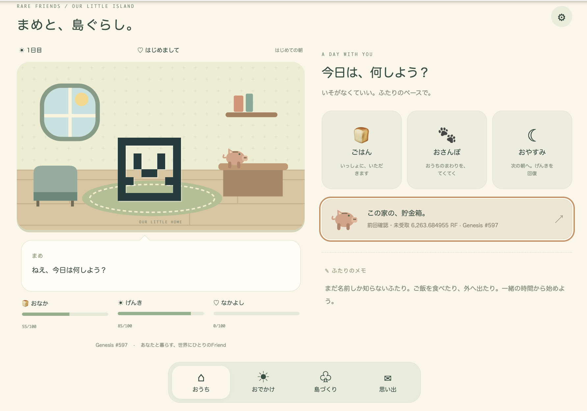
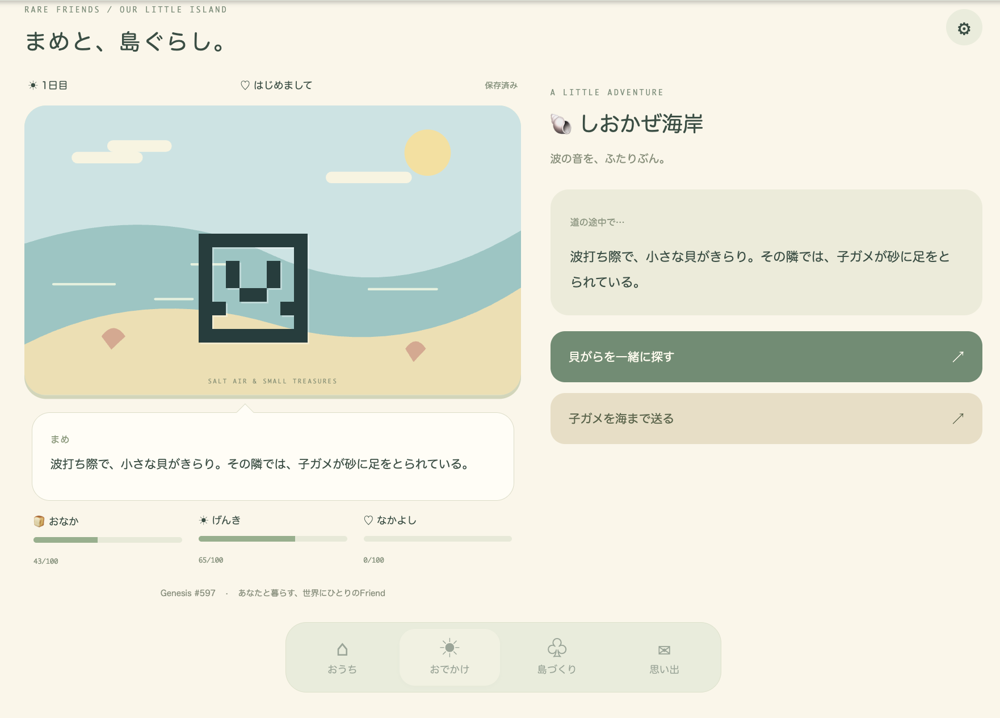
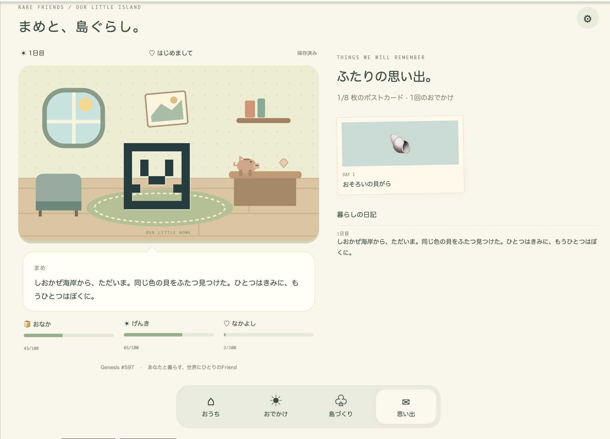
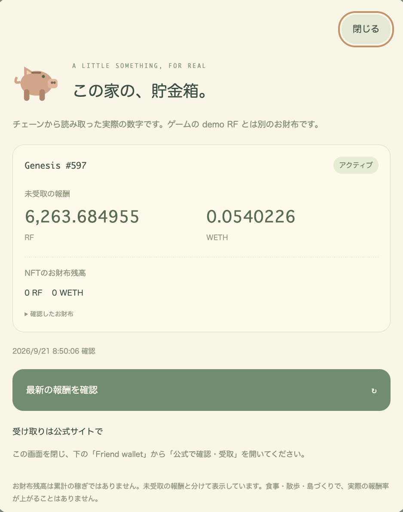

# Rare Friends: Our Little Island

**A Friend to come home to. An island you grow together.**

A cozy, persistent virtual-pet and island-building game where your own Rare Friend becomes a companion with favorite food, shared outings and memories—and a piggy bank that shows its actual on-chain rewards.

- **Builder/contact:** [@horusuzu](https://github.com/horusuzu), Genesis #597 holder. Contact through this submission PR or [source issues](https://github.com/horusuzu/rare-friends-lost-and-found/issues).
- **Category:** Character Spotlight. Secondary design relevance: Economy Potential. No claim of live token spending or burning.
- **Play:** [Public playable preview](https://horusuzu.github.io/rare-friends-lost-and-found/)
- **Source:** [Repository](https://github.com/horusuzu/rare-friends-lost-and-found), [submitted code revision](https://github.com/horusuzu/rare-friends-lost-and-found/tree/654f029), [game directory](https://github.com/horusuzu/rare-friends-lost-and-found/tree/654f029/games/lost-and-found).
- **Stack:** FriendSDK v0.1.2 with documented companion-preview extensions, React 19, TypeScript, original SVG scenery and Canvas postcards. Built with Codex.



## Why this belongs in Rare Friends

The selected NFT is the main character, not a login badge. Its canonical pixel portrait lives in the room and accompanies the player to the shore, forest, bakery plaza and lighthouse. Each NFT has its own care save and a stable favorite food. Naming it, discovering its preferences and keeping postcards gives the holder a reason to return beyond checking a balance.

The first prototype was a short delivery game. The holder's feedback was direct: it worked, but did not create attachment. This version was rebuilt around ordinary time together: eat, walk, make a choice, bring something home, and slowly change the island. The holder has now played the Genesis version with their real wallet; the four screenshots here are from that playtest on September 21, 2026.

Generations NFTs remain fully playable with fresh ownership and generation checks and canonical character art. At the holder's request, the preview also supports their Genesis #597 as a companion, using its own canonical on-chain portrait rather than treating its token ID as a Generations ID.

## One complete interaction

1. Connect a compatible browser wallet on **Robinhood mainnet, chain 4663**. Own a **Generations NFT of generation 1 or higher**, or the configured **Genesis #597**. Choose your NFT. No signature, activation change or RF funding is needed.
2. Give your Friend a name in settings. Feed it and discover its favorite food.
3. Open **Outings**, visit the shore, and choose between looking for matching shells or helping a baby turtle reach the sea.
4. Return home with materials and a personal postcard. The room and journal remember the outing.
5. Build a flower garden, sleep to advance the game day, and pick the flowers. Later, build a bench or a bridge to unlock the lighthouse.
6. Open the room's **piggy bank** to check actual claimable RF/WETH and the NFT wallet's holdings, displayed separately from simulated gameplay.



### Controls and language

Click or tap the action cards; keyboard Tab/Enter works for controls. There is no movement joystick or time-sensitive input. Use **English / 日本語** at the top to switch the interface, dialogue, outings, existing journal entries, postcards and reward explanations. The language is saved with the selected NFT’s care data. Existing names and progress remain unchanged.

| Label | Meaning |
| --- | --- |
| おうち | Home |
| ごはん / おさんぽ / おやすみ | Feed / Walk / Sleep to the next game day |
| おでかけ | Outings |
| 島づくり | Build the island |
| 思い出 | Memories and postcards |
| 貯金箱 | Real-reward piggy bank |
| 設定 / Friendの呼び名 | Settings / Name your Friend |
| 貝がらを一緒に探す | Look for shells together |
| 子ガメを海まで送る | Help the baby turtle reach the sea |
| おみやげを持って帰る | Bring the souvenirs home |

There are four outing destinations, two choices at each destination, eight collectible postcards, three island projects, friendship stages and a bounded journal. Sleep advances the day; there is no real-time wait and no neglect penalty while away. Stories are original fiction, not official Rare Friends lore. There is no audio; reduced-motion preferences are supported.



## The piggy bank: a connection to the real NFT economy

The piggy bank reads the selected NFT's actual activation position, claimable RF/WETH and canonical NFT-wallet balances at a verified block. Wallet holdings are **not** presented as lifetime earnings. Failed reads show an error; a failed refresh keeps the previous value with an explicit stale-value notice, rather than inventing a zero.

Genesis and Generations use their own collection addresses and canonical wallets. When playing a Generations Friend, the configured Genesis #597 is shown separately only if the connected account also owns it. When playing Genesis itself, there is no duplicate linked record.



*These are historical values at the timestamp in the screenshot, not a forecast or guaranteed yield. Feeding, walking and building do not increase real reward rates. Receiving rewards or changing activation is left to the official portfolio, linked from the trusted Friend wallet menu. The game never claims or moves funds.*

## Costs, rewards and future integration

- Care, outings, materials, construction and postcards are free **simulated progression**. Choices produce deterministic game outcomes, not a randomized financial payout. There is no RF redemption.
- The optional gold room frame costs **2 demo RF** through the SDK's simulated purchase flow. It is cosmetic, gives no progression advantage, and lasts for that connection session. Repeat purchases are disabled after acquisition.
- Reloading resets the demo RF ledger and session cosmetic, while care progress remains saved. No consumable is used for a paid chance game; the unused one-wei reward in `game.json` is an SDK schema placeholder, never a payout.
- No real RF spending, burning, minting, trading, creator fees or live game contracts are included. Read-only existing NFT rewards are separate from the game economy.

A possible production extension is RF-priced home decorations with durable inventory. It is **not implemented** and would require a separately reviewed integration. The current prototype demonstrates attachment and a place for that economy; it does not claim measured retention or token activity.

## SDK extensions and review notes

This uses a **modified FriendSDK v0.1.2 runtime**, not an unmodified upstream integration:

- Preview-only local-save and fixed read-only reward methods cross the opaque iframe via MessagePort. The trusted host chooses the save namespace and verified NFT wallet; game code cannot select arbitrary storage keys or execute transactions.
- Generations retains the fresh `readGenerationEligibility` gate. The explicit `allowGenesisPreview` opt-in adds direct fresh ownership verification for the configured Genesis #597. This is an extension beyond the event README's Generations-only SDK eligibility; it is not a claim that Genesis qualifies for the Generations-focused category by itself. Other Genesis IDs are not automatically discovered in this build.
- The responsive portrait/wide companion layout extends beyond the event README's fixed 960 × 640 SDK viewport. It keeps one trusted runtime and one sandboxed game frame. We disclose this difference for organizer review rather than claiming strict viewport compliance.
- Genesis is rejected for live deployments. Wallet identity, connection and confirmations stay in the trusted host. The iframe remains `sandbox="allow-scripts"`, without same-origin or navigation powers. Account/network/selection changes tear down the old session.

## Run it locally

Node.js 22 or newer:

```sh
git clone https://github.com/horusuzu/rare-friends-lost-and-found.git
cd rare-friends-lost-and-found
git checkout 654f029
npm ci
npm run build
node scripts/dev-game.mjs dev games/lost-and-found
```

Open the printed local URL in a wallet-enabled browser. The same real NFT/network requirements apply locally; no sample identity bypass is shipped.

For the home-screen-capable static package, run `node scripts/build-island-life.mjs ./my-new-release` using a new output directory. See the [game instructions](https://github.com/horusuzu/rare-friends-lost-and-found/blob/654f029/games/lost-and-found/README.md).

## Validation and limitations

English/Japanese switching, translated old memories, English outing/postcard/settings journeys, locale persistence after reload, and returning to Japanese were additionally tested at both viewport sizes.

- SDK build, SDK/game typechecks, game validation and desktop/mobile browser journeys pass. Automated browser tests use isolated wallet/RPC fixtures; these are never published as playable identities.
- At 390 × 844 and 1100 × 900, tests cover care, outing choices, return, postcards, construction, sleep, harvest, naming, save/reload and simulated cosmetic purchase.
- Genesis tests cover picker selection, canonical portrait, separate saves, switching collections, network changes, and rejecting ownership transferred after discovery. Read-only reward tests cover correct collections, wallet balances versus claimable amounts, stale errors and refreshes.
- Identity/art/reward reader tests enforce at least 80% coverage; measured 100% lines/functions and 98.67% branches. Independent review checked ownership boundaries and collection isolation.
- Direct live read verified Genesis #597 ownership, canonical portrait, active position and real rewards. The holder also played with their own wallet and supplied the screenshots above. No signatures or transfers were performed.
- Public GitHub Pages assets were checked against the tested build. [Detailed validation record](https://github.com/horusuzu/rare-friends-lost-and-found/blob/654f029/games/lost-and-found/VALIDATION.md).

Progress is local to the browser and NFT wallet, with no cloud sync or multiplayer. Clearing browser data removes progress. Home-screen installation is supported by web-app metadata, but the browser context still needs an injected wallet and online ownership verification; no mobile wallet relay or guaranteed offline play is provided. Physical iPhone/PWA wallet compatibility has not been comprehensively tested. English and Japanese are supported. Public RPC failures can temporarily block connection or reward reads; errors and retry controls are visible.

## Credits

FriendSDK code is Apache-2.0; canonical Rare Friends artwork follows the project's [NOTICE](https://github.com/horusuzu/rare-friends-lost-and-found/blob/654f029/NOTICE.md). Rooms, island scenery, stories, app icon and postcard layouts are original project assets. System emoji are used for some activity icons. No proprietary characters, logos or artwork from other virtual-pet or life-simulation games are included.
