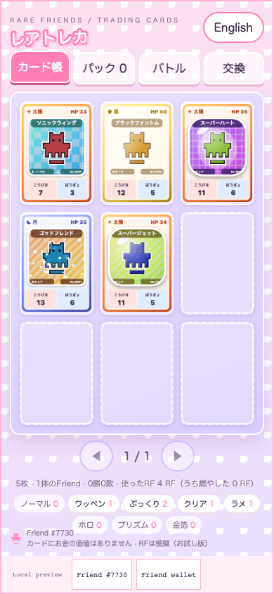
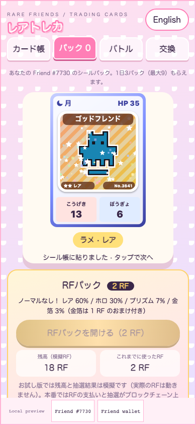
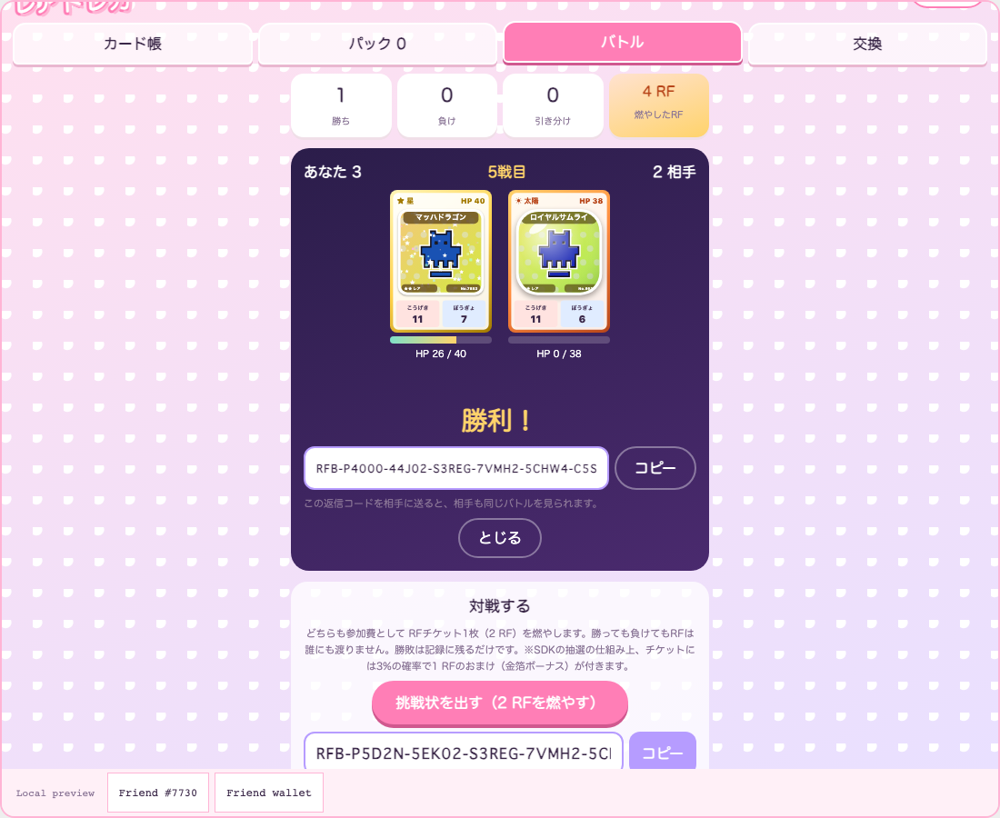
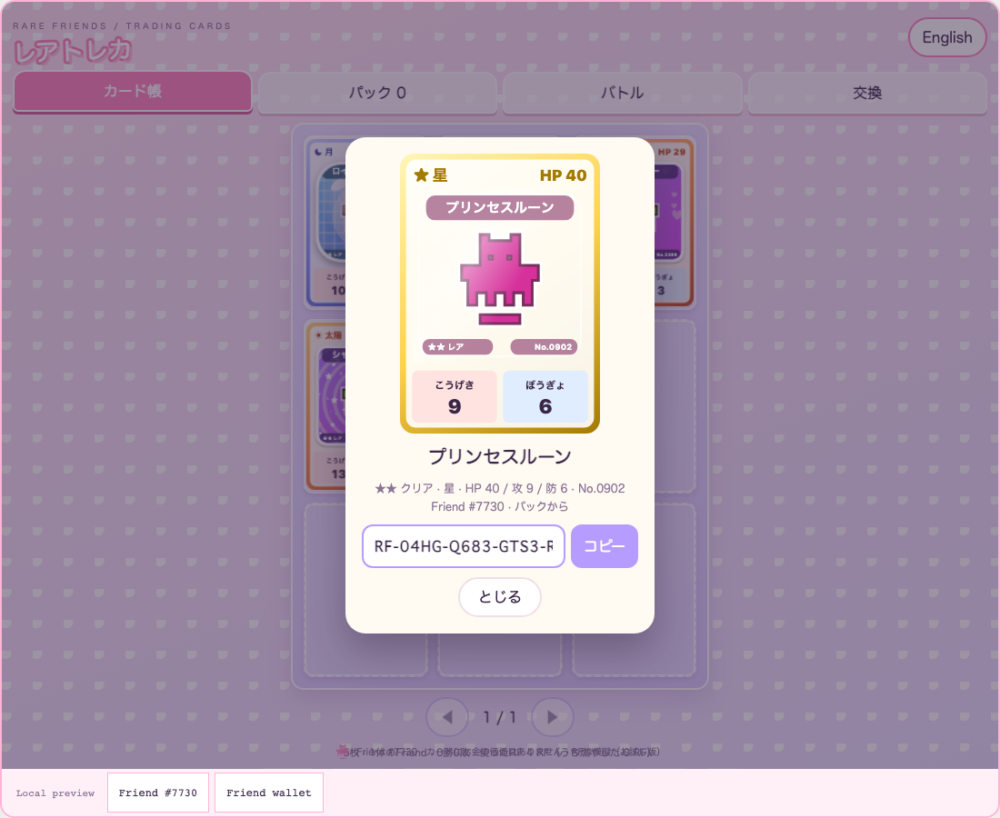

# Rare Cards / レアトレカ

**Your Friend as a trading card. Burn RF to battle.**

A trading-card game for Rare Friends holders. Packs turn your own Friend into cards in eight finishes (matte, embroidered patch, puffy, clear, glitter, holo, prism foil, gold foil); cards live in a nine-pocket binder, trade between holders by code, and fight in five-card PvP battles where **both players burn an RF ticket to enter and no RF changes hands**.

- **Builder/contact:** [@horusuzu](https://github.com/horusuzu), Genesis #597 holder. Contact through this PR or [source issues](https://github.com/horusuzu/rare-friends-lost-and-found/issues).
- **Category:** Token Activity.
- **Play:** [Rare Cards](https://horusuzu.github.io/rare-friends-lost-and-found/stickers/)
- **Source:** [Game and run instructions](https://github.com/horusuzu/rare-friends-lost-and-found/tree/ca174019b4d0164baa2d193392aed34bdd7138c3/games/rare-stickers). The repository also contains the holder's other entries; this one is a separate game and URL.
- **Stack:** FriendSDK v0.1.2 (chance-game client for RF tickets) with documented preview extensions, React, TypeScript and Canvas. Built with Claude Code.



## How it spends and burns RF

One consumable, the **RF ticket (2 RF)**, runs through the SDK chance game (`buy → play → settle`, host confirmation each time):

| Use | What happens to the RF |
|---|---|
| **RF pack** | 1 ticket. The SDK outcome picks the card: Rare (puffy/clear/glitter) 60 %, Holo 30 %, Prism 7 %, Gold Foil 3 % (includes a 1 RF bonus that can be redeemed). No commons. |
| **Battle entry** | 1 ticket **per player** per battle, burned. No prize pool, no transfer between players; the winner gets only the win in their record. |

Expected return is 0.03 RF per 2 RF ticket, so about **98.5 % of RF spent stays spent** — and every battle consumes two tickets (one from each player). The binder and battle screens show RF spent and RF burned. Free packs (three a day) keep the game playable without RF.

Because the SDK has no pure burn call, an entry ticket is still drawn like any ticket and carries the same 3 % chance of the 1 RF gold bonus; the screen says so. In this preview, balances (20 simulated RF), draws and burns are the SDK's simulated ledger — no real RF moves. Live, the same calls would run on-chain; ticket RF goes to the game contract, so sending entry fees to an unrecoverable address would need a contract-side change with the Rare Friends team. Betting in which the winner takes the loser's RF was deliberately not built.



## Battles (asynchronous PvP by codes)

1. Pick five cards in order and **issue a challenge** — burn one ticket, get a battle code (`RFB-…`) to send.
2. Your friend pastes it, picks a deck, burns one ticket and watches the battle; they receive a **reply code**.
3. Paste the reply and you watch the identical battle.

Each round, cards trade blows (attack × element bonus − defence, a small spread and 10 % criticals) until one falls; best of five wins. Sun beats Moon, Moon beats Star, Star beats Sun. Results are deterministic from both decks and the challenge nonce, so both sides see the same fight. A challenge can be answered once and a reply counted once; you cannot answer your own challenge.



## Cards, binder and trading

Card stats (element, HP, attack, defence) come from the card itself; rarer finishes are stronger. Tap or press Enter on a pocket to view a card large — shiny finishes glint as the pointer moves. A card's trade code (`RF-…`) passes its design to another holder, whose game reads that Friend's canonical art from the chain. Your own Friend comes only from packs, other Friends only from trades, and a binder never holds the same card twice.



## Try it

Open the preview in a browser with an injected wallet (or a mobile wallet's in-app browser) on Robinhood mainnet, **chain 4663**. Choose an owned hardwired **Generations NFT (generation 1+)** or the configured **Genesis #597**; the trusted host checks current ownership. No real RF, activation or signature is needed for the preview.

## Run locally

```sh
git clone --branch feat/rare-stickers https://github.com/horusuzu/rare-friends-lost-and-found.git
cd rare-friends-lost-and-found
npm ci
npm run build
node scripts/dev-game.mjs dev games/rare-stickers
```

## Checks and limitations

Validated source revision: [`ca17401`](https://github.com/horusuzu/rare-friends-lost-and-found/tree/ca174019b4d0164baa2d193392aed34bdd7138c3); the repository's GitHub Actions checks pass on it.

- 11 unit tests (packs and odds, trade/battle code round-trips and typo rejection, stats, element triangle, deterministic best-of-five battles with side-swap mirroring, battle record, challenges, saves under 32 KB); 100 % line coverage of the card and book modules.
- Browser checks at 320×568, 390×844, 844×390, 960×640 and 1100×900: three free packs, two RF packs through host confirmations (4 RF spent), binder pockets, keyboard card view, trade code, deck picking, issuing a challenge (2 RF burned), answering a rival challenge with replay and reply code (4 RF burned), refusing a second answer and self-answers, settling a reply without extra burn, language switch and overflow.
- Genesis #597 selection, launch, receiving a traded card, duplicate refusal and transferred-owner rejection at 390 and 1100 px.
- Repository tests (146 pass, 0 fail, 2 skipped), typecheck and SDK game validation for every game.

Known limits: codes are unsigned and are not proofs of card ownership (friendly matches). The responder sees the challenger's ordered deck before choosing theirs, so a determined responder could pre-compute an order (a commit–reveal exchange would fix it). At most ten challenges can wait for replies. Saves are local to the browser and NFT session. Real-wallet play on the public URL and physical-device testing are not claimed.

The Genesis preview is a fork addition for review, not an upstream SDK capability or Rare Friends production approval. This entry is separate from Our Little Island (#20), Rare Invaders (#40), Rare Drop (#48) and Rare Rush (#52).

## Credits

Canonical Friend artwork and runtime: Rare Friends / FriendSDK, retaining [LICENSE](https://github.com/horusuzu/rare-friends-lost-and-found/blob/feat/rare-stickers/LICENSE), [NOTICE](https://github.com/horusuzu/rare-friends-lost-and-found/blob/feat/rare-stickers/NOTICE.md) and SDK asset provenance. Every finish, frame, backdrop, name and battle effect is drawn or generated in code; no third-party card, sticker or brand names or assets are used.
