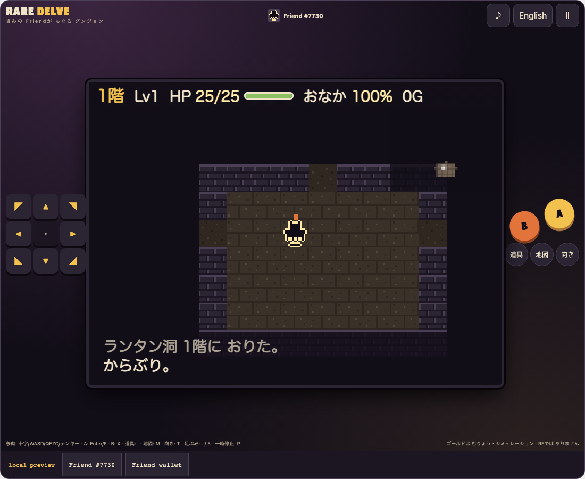
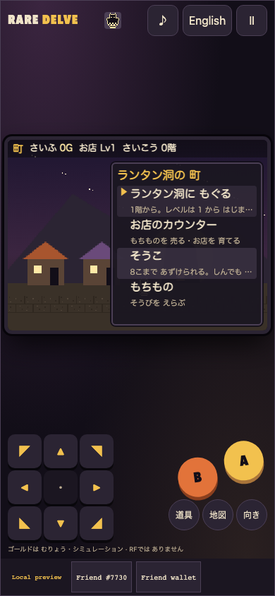
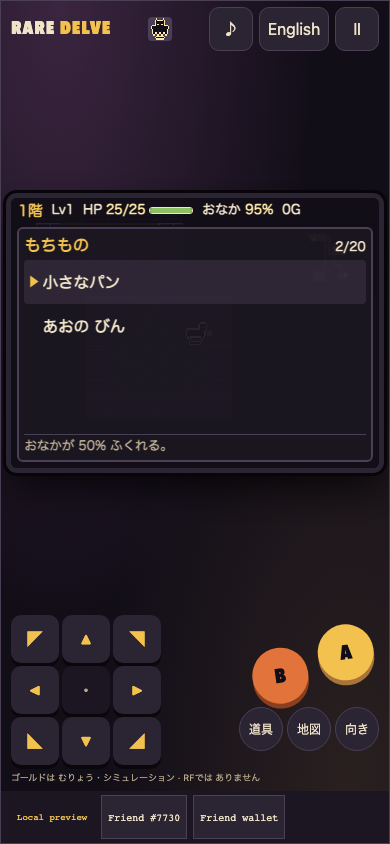
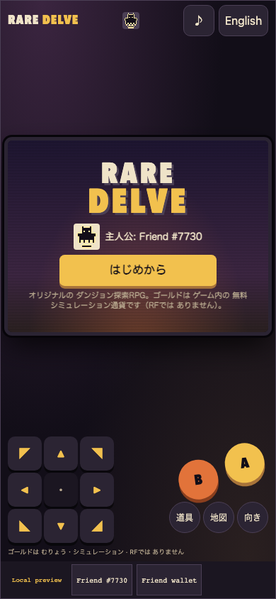

# Rare Delve / レアデルヴ

**Your Friend keeps a shop above a cave that is dug anew on every dive.**

An original turn-based roguelike. Your verified Rare Friends NFT is the shopkeeper-adventurer: dive into **Lantern Hollow**, ten random floors deep, fight, guess what unmarked bottles, scrolls and wands do, keep your belly full, and carry treasure home to sell and grow the shop. Fall, and everything you carried is lost. The hero is your own Friend, drawn from its canonical on-chain sprite.

- **Builder/contact:** [@horusuzu](https://github.com/horusuzu), Genesis #597 holder. Contact through this PR or [source issues](https://github.com/horusuzu/rare-friends-lost-and-found/issues).
- **Category:** Economy Potential.
- **Play:** [Rare Delve](https://horusuzu.github.io/rare-friends-lost-and-found/delve/)
- **Source:** [Game and run instructions](https://github.com/horusuzu/rare-friends-lost-and-found/tree/ff22fc29c3cdd8f8f24c23eb7391a02be06f78d9/games/rare-delve). The repository also contains the holder's other entries; this one is a separate game and URL.
- **Stack:** FriendSDK v0.1.2 (host, eligibility, canonical sprite reader, `saveLocal`), React, TypeScript and a deterministic engine rendered to a scrolling canvas. Built with Claude Code.



## The loop

1. **Town.** Four places: dive, the shop counter (sell what you bring back; upgrade the shop for better free provisions), a storage chest that keeps 8 items safe between dives, and your bag.
2. **Dive.** Always start at floor 1, level 1. Each 40 × 28 floor has lit rooms, dark corridors, sleeping and wandering monsters, items, gold and hidden traps. Every action is one turn; nothing moves while you think.
3. **Come back.** Pick up the **Heart Lantern** on floor 10 (clear, +1 000 G bonus), or read a Homeward Scroll to return early. If you fall, you lose your bag, gear and carried gold; the purse, chest and shop level stay.



## Dungeon rules

- **8-way movement** on a grid; diagonals cannot cut wall corners. Walk into a monster to attack; turn in place for free.
- **12 original monsters** with quirks, including gold thieves, shield-rusting slugs, archers that shoot along lines, jellies that split, toads that swallow floor items, strength-draining wasps, confusing bats and slow, heavy-hitting tortoises.
- **34 item kinds**: food, herbs, weapons and shields with enchantments, darts, treasures. **Draughts, scrolls and wands start unidentified**, with looks shuffled per dive: drink, read, zap or throw to learn them.
- **Hunger**: the belly drops 1 % every 9 turns; at 0 % you lose HP each turn. **Regeneration** is slow, so damage carries between fights.
- **Traps**: trip snares, pitfalls and clapper traps stay hidden until found by waiting beside them or stepping on them.
- **Suspend save**: pause → suspend & save stores the exact dive; a dive is settled the moment it ends, so reloading cannot undo a death.



## Balance

Difficulty is measured, not guessed. Two scripted players each run 40 seeded first dives: one that never aims items, and a skilled one that throws darts and potions, zaps wands at dangerous monsters and test-drinks unknown bottles. After the holder's playtest ("too easy"), monsters, spawn rates, regeneration, hunger and healing drops were retuned. Before the retune the skilled player cleared 37 % of first dives; now it clears about one in six or seven, a few dives end on floors 1–3, and most deaths come from floor 5 on. A test keeps these bands.

## Economy

**No RF is used in this preview.** Gold is a free, simulated in-game currency with no value that cannot be redeemed; the screen says so on the title, in the shop and in the footer. The game calls no buy, play, settle or redeem action; the chance-game block in `game.json` is an unused placeholder required by the CLI.

Why Economy Potential: the game already has the sinks and faucets a token economy needs, all balanced by play rather than by chance.
- **Faucets.** Gold piles, monster loot and treasures that exist only to be sold.
- **Sinks.** Shop upgrades (400 G, 1 200 G).
- **Loss.** Everything carried is lost on death.
- **Durable storage.** The chest.

A later phase with the Rare Friends team could back the shop upgrades or the chest with RF, or add an RF-priced entry to a harder "deep" hollow. None of that is built or promised here.

## Controls

| Action | Touch | Keyboard |
| --- | --- | --- |
| Move / attack | 8-way pad | Arrows or WASD (hold two for diagonals), Q E Z C, numpad |
| Wait and search | centre of pad | `.`, Space, numpad 5 |
| A: attack ahead, confirm, stairs | A | Enter, F, J |
| B: back | B | X, Backspace, K |
| Bag / map / turn in place | 道具 / 地図 / 向き | I / M / T + direction |
| Pause, suspend | Ⅱ | P, Escape |

Japanese by default with an English toggle, mute, reduced motion (system setting or pause menu), and controls of at least 44 px.



## Try it

Open the preview in a browser with an injected wallet (or a mobile wallet's in-app browser) on Robinhood mainnet, **chain 4663**. Choose an owned hardwired **Generations NFT (generation 1+)** or the configured **Genesis #597**; the trusted host checks current ownership. No RF, activation or signature is needed. If the public RPC stalls while your Friends load, the host now stops after 20 seconds and offers **Retry loading Friends**.

## Run locally

```sh
git clone --branch feat/rare-dungeon https://github.com/horusuzu/rare-friends-lost-and-found.git
cd rare-friends-lost-and-found
npm ci
npm run build
node scripts/dev-game.mjs dev games/rare-delve
```

## Checks and limitations

**Updated 2026-09-26.** The linked revision (`ff22fc2`) adds phone layouts (a larger play area, thumb-reach controls, no double-tap zoom, pull-to-refresh or long-press menus during play) to the originally submitted code. The repository's GitHub Actions checks pass on it, and the game's new phone test passes at 360×640, 375×667, 390×664, 430×740 and 664×390 (Chromium phone emulation; not yet on physical devices).

Validated source revision: [`ff22fc2`](https://github.com/horusuzu/rare-friends-lost-and-found/tree/ff22fc29c3cdd8f8f24c23eb7391a02be06f78d9); the repository's GitHub Actions checks pass on it.

- **Engine tests:** 65 pass. They cover:
  - floor generation and reachability, 8-way movement and corners, fog;
  - every monster quirk, combat and levelling, hunger and regeneration, traps;
  - identification, every item effect, throwing and wands;
  - town, shop, chest and bag;
  - suspend/resume identity, tamper-rejecting saves;
  - the balance bands.
- **Browser checks** pass at 320×568, 390×844, 844×390, 960×640 and 1100×900. The run covers town, shop, dive, attack, wait, turn in place, pick up, bag with unidentified names, eating, map, stairs, pause, language, overflow, and suspend then reload and continue.
- **Genesis #597:** selection, dive and transferred-owner rejection pass at 390 and 1100 px.
- **Repository:** tests (147 pass, 0 fail, 2 skipped), typecheck and SDK game validation pass.

Known limits:
- The chest, death and clear result screens and reaching floor 10 are covered by engine tests, not browser runs.
- The phone portrait view leaves empty space around a small dungeon view.
- Saves are local to the browser and NFT session.
- Real-wallet play on the public URL and physical-device testing are not claimed.

The Genesis preview is a fork addition for review, not an upstream SDK capability or Rare Friends production approval. This entry is separate from Our Little Island (#20), Rare Invaders (#40), Rare Drop (#48), Rare Rush (#52), Rare Cards (#55) and Rare Quest (#56).

## Originality and credits

Rare Delve is inspired by the turn-based roguelike genre in general (random floors, hunger, unidentified items, a town between dives). All names, monsters, items, maps, text, pixel art, sound cues and interface are original; no names or assets from any other game series or company are used, and nothing is extracted, traced or copied. Canonical Friend artwork and runtime: Rare Friends / FriendSDK, retaining [LICENSE](https://github.com/horusuzu/rare-friends-lost-and-found/blob/feat/rare-dungeon/LICENSE), [NOTICE](https://github.com/horusuzu/rare-friends-lost-and-found/blob/feat/rare-dungeon/NOTICE.md) and SDK asset provenance.
