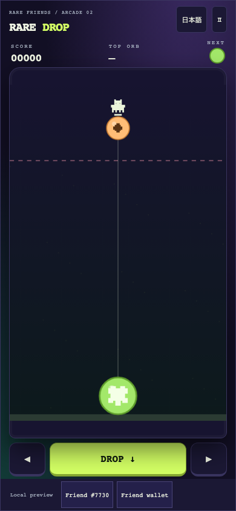
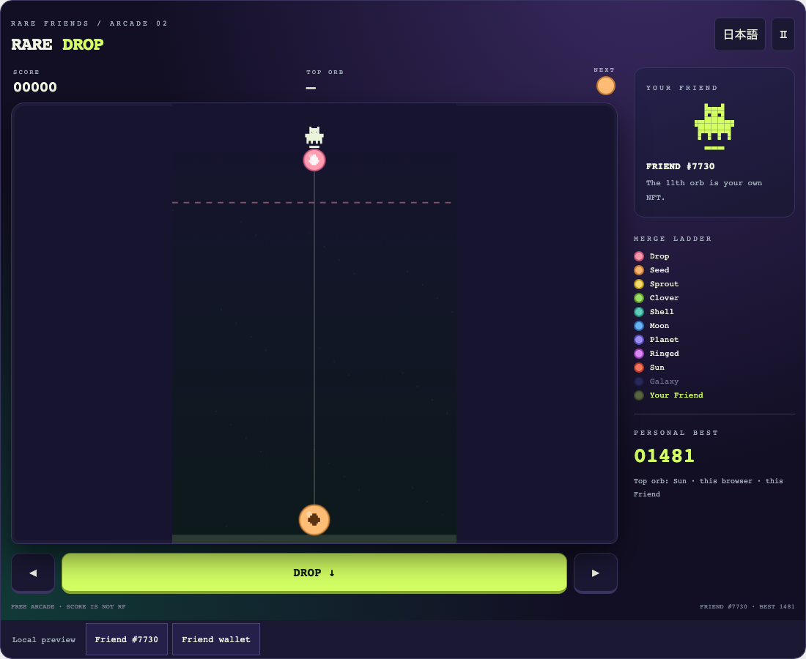
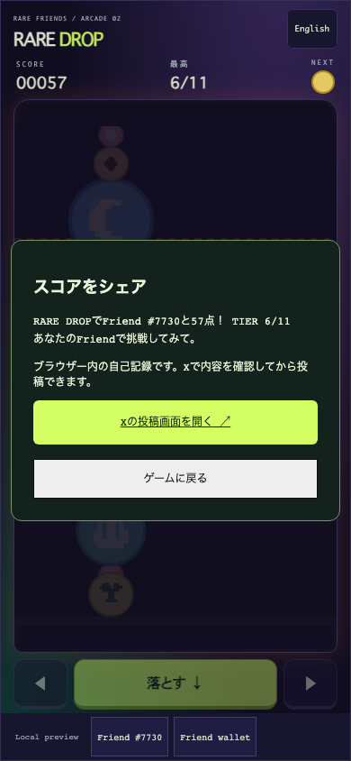

# Rare Drop

**Drop. Merge. Meet your Friend.**

A mobile-friendly merge-drop puzzle where two of a kind grow into the next orb, and the eleventh and largest orb is your own Rare Friend, drawn from its canonical on-chain pixels. Your Friend also rides the dropper at the top of the jar.

- **Builder/contact:** [@horusuzu](https://github.com/horusuzu), Genesis #597 holder. Contact through this PR or [source issues](https://github.com/horusuzu/rare-friends-lost-and-found/issues).
- **Category:** Character Spotlight.
- **Play:** [Rare Drop](https://horusuzu.github.io/rare-friends-lost-and-found/drop/)
- **Source:** [Game and run instructions](https://github.com/horusuzu/rare-friends-lost-and-found/tree/91c5bc0843d9e164b610472bde98f381f8d2ec42/games/rare-drop). The source repository also contains Our Little Island and Rare Invaders; Rare Drop is a separate entry and URL.
- **Stack:** FriendSDK v0.1.2 with documented preview extensions, React, TypeScript and Canvas, with a small deterministic circle-physics engine written for this game. Built with Claude Code.



## Why Rare Friends

The selected NFT is the goal of every run. Each merge climbs an eleven-step ladder — Drop, Seed, Sprout, Clover, Shell, Moon, Planet, Ringed, Sun, Galaxy — and the final orb is the player's own Friend, rendered from the canonical sprite read through the SDK. The same sprite rides the dropper and appears at the end of the ladder on the start screen, so the NFT stays on screen for the whole game. Generations NFTs remain the main entry path; at the holder's request, their Genesis #597 is also playable using the collection-specific ownership gate and artwork reader already used by the holder's other entries.

## Try one complete run

1. Open the preview in a browser with a compatible injected wallet, including a mobile wallet's in-app browser. Use Robinhood mainnet, **chain 4663**.
2. Select an owned, hardwired **Generations NFT (generation 1+)**, or the configured **Genesis #597**. The trusted host checks current ownership before starting. No activation, RF funding or transaction signature is required.
3. Start in Japanese or English. Aim and drop orbs into the jar. Two orbs of the same tier merge into the next tier.
4. Only the first five tiers are dropped; the rest are earned. Two Friend orbs merge and vanish for a bonus.
5. The run ends when an orb rests above the dashed line for two seconds (new drops get a 1.2-second grace period).
6. On the result screen choose **Share score on X**. A trusted host dialog previews the score, the top tier reached and the NFT. Open X's composer, review the draft and post yourself. The game never posts automatically.

### Controls

- **Phone:** drag on the jar to aim and release to drop, or hold ◀ ▶ and tap **DROP**. Buttons are at least 44 px tall; the wallet toolbar has its own row.
- **Computer:** move the pointer and click, or arrow keys / A-D to aim and Space / Enter / ↓ to drop. P / Escape or the pause button pauses.
- **Landscape:** compact side column with score, next orb and controls; portrait and the 960 × 640 reference size are also supported.
- Switching away pauses play. There is no audio. Reduced-motion preference removes merge ring effects and the blinking warning line.

## Scoring, costs and rewards

Creating tier *n* scores the *n*-th triangular number (1, 3, 6, 10 … 66); two Friend orbs vanishing score 132. The next orb is drawn uniformly from tiers 1–5 by a seeded generator.

Free play, no RF spending, burning, prizes, consumables or redemption. Scores have no monetary value and are self-reported browser-local results, not verified rankings. The required SDK chance-game schema is unused: no buy/play/settle/redeem call is made. The host's preview balance is simulated.

The X draft contains the score, the top tier reached (1–11), the selected NFT label, the game URL and hashtags, and no wallet address. The game iframe keeps `sandbox="allow-scripts"`; the bounded bridge request carries only score, tier and language. The host's fixed per-game table supplies the title and URL, so game code cannot choose a destination.





## Run locally

Node.js 22+:

```sh
git clone --branch feat/rare-drop https://github.com/horusuzu/rare-friends-lost-and-found.git
cd rare-friends-lost-and-found
npm ci
npm run build
node scripts/dev-game.mjs dev games/rare-drop
```

For static hosting, run `node scripts/dev-game.mjs build games/rare-drop --outdir release-drop` and keep LICENSE, NOTICE.md and asset provenance with the build. No private key is needed.

## Checks and limitations

Validated source revision: [`91c5bc0`](https://github.com/horusuzu/rare-friends-lost-and-found/tree/91c5bc0843d9e164b610472bde98f381f8d2ec42). All checks below passed before submission. Engine coverage: 100% lines/functions, 97.83% branches. Automated browser checks use SDK wallet/RPC fixtures; screenshots show fixture Friend #7730, not a claim of ownership.

- Engine tests (9) cover deterministic piece generation, aim clamping, drop cooldown, falling to rest, single merges and three-in-a-row, non-merging separation, the Friend-orb bonus, a 45-drop pile staying inside the jar with bounded speeds, and the two-second danger rule.
- Browser checks at 320×568, 390×844, 844×390, 960×640 and 1100×900 cover start, pause/resume, tap-to-drop, button and keyboard drops, a full run to the result screen, the X draft text and fixed URL, an intercepted composer, retry in English, separation of game and wallet controls, and horizontal overflow.
- Genesis #597 selection, launch and rejection after an ownership transfer pass at 390 and 1100 px.
- Repository `npm test` (145 pass, 0 fail, 2 skipped), typecheck, SDK game validation for every game, and the existing Rare Invaders mobile/share browser check all pass with the shared score-share change.

Best scores are local to the browser and NFT session. No online leaderboard or anti-cheat. X login and final posting are handled by X; automated tests never publish a post. Mobile wallet availability depends on the browser; standalone Safari/Chrome without an injected wallet cannot connect. Browser tests emulate device sizes; they are not physical iOS/Android certification. Play with a real wallet on the public URL has not yet been confirmed by the holder for this entry; the published page was checked to load and show the ownership gate.

The Genesis preview and trusted score-sharing extensions are fork additions for review, not upstream SDK capabilities or Rare Friends production approval. This entry does not replace Our Little Island (PR #20) or Rare Invaders (PR #40).

## Credits

Canonical Friend artwork and runtime: Rare Friends / FriendSDK, retaining [LICENSE](https://github.com/horusuzu/rare-friends-lost-and-found/blob/feat/rare-drop/LICENSE), [NOTICE](https://github.com/horusuzu/rare-friends-lost-and-found/blob/feat/rare-drop/NOTICE.md) and SDK asset provenance. Orb motifs, jar and interface are drawn by this game's code. Merge-drop is a common puzzle genre; no third-party game logo, music or extracted assets are included.
