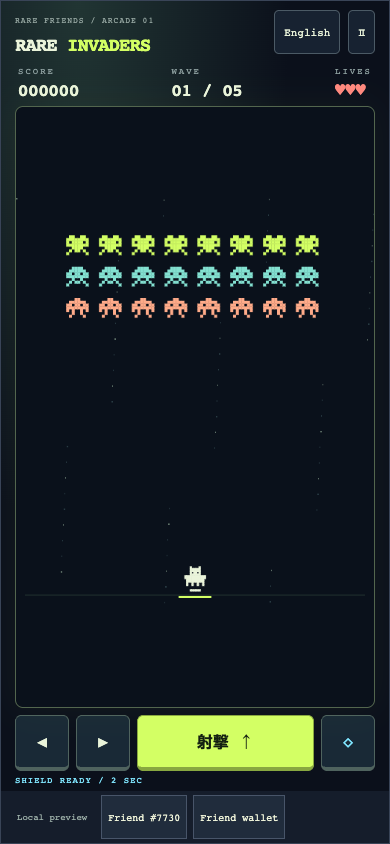
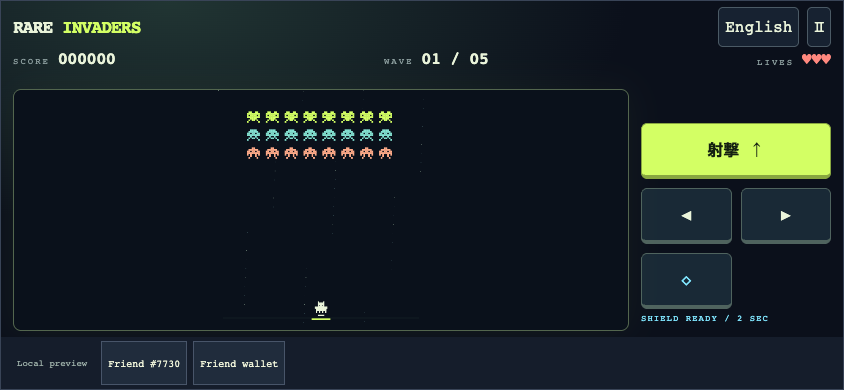
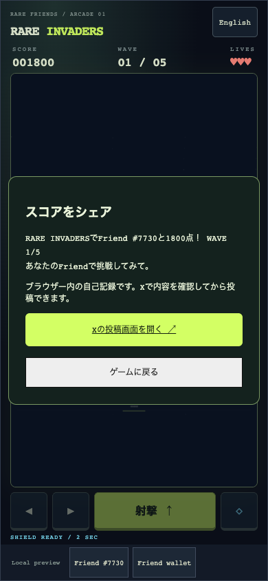

# Rare Invaders

**Small Friend. Big fight.**

A mobile-friendly, five-wave arcade shooter where your own Rare Friend's canonical pixel character pilots the defense, then shares a personal score challenge on X.

- **Builder/contact:** [@horusuzu](https://github.com/horusuzu), Genesis #597 holder. Contact through this PR or [source issues](https://github.com/horusuzu/rare-friends-lost-and-found/issues).
- **Category:** Character Spotlight.
- **Play:** [Rare Invaders](https://horusuzu.github.io/rare-friends-lost-and-found/invaders/)
- **Source:** [Game and run instructions](https://github.com/horusuzu/rare-friends-lost-and-found/tree/b43c032/games/rare-invaders). The source repository also contains Our Little Island; Rare Invaders is a separate entry and URL.
- **Stack:** FriendSDK v0.1.2 with documented preview extensions, React, TypeScript and Canvas. Built with Codex.



## Why Rare Friends

The selected NFT is the player, using its canonical on-chain pixel art. Its collection and identity follow the session, personal best and score challenge. Connect, choose your Friend, and immediately play a short arcade run. Generations NFTs remain the main entry path; at the holder's request, their Genesis #597 is also playable using a collection-specific ownership gate and artwork reader.

## Try one complete run

1. Open the preview in a browser with a compatible injected wallet, including a mobile wallet's in-app browser. Use Robinhood mainnet, **chain 4663**.
2. Select an owned, hardwired **Generations NFT (generation 1+)**, or the configured **Genesis #597**. The trusted host checks current ownership before starting. No activation, RF funding or transaction signature is required.
3. Launch in Japanese or English. Move left/right, hold fire, and use the two-second shield when needed; its cooldown is eight seconds.
4. Clear five waves with three lives. Enemies descend at the edges; reaching the player line ends the run. Later waves move faster and introduce stronger enemies.
5. After game over or clearing the final wave, choose **Share score on X**. A trusted host dialog previews the score and NFT. Open X's composer, review the draft and post yourself. The game never posts automatically.

### Controls

- **Phone:** hold the left/right and fire buttons simultaneously; tap the diamond for a shield. Buttons are sized for touch. The wallet toolbar occupies its own row, outside the gameplay controls.
- **Computer:** arrow keys or A/D to move, Space to fire, Shift to shield, P/Escape or the pause button to pause.
- **Landscape:** compact two-column controls; portrait and the 960 × 640 reference viewport are also supported.
- Switching away pauses gameplay. There is no audio. Reduced-motion preference stops moving star effects.



## Costs, rewards and sharing

Free play, no RF spending, burning, prizes, consumables or redemption. Scores have no monetary value and are self-reported browser-local results, not verified competitive rankings. The required SDK chance-game schema is unused: no buy/play/settle/redeem call is made. The host's preview balance is simulated.

The X draft contains the score, wave/clear result, selected NFT label, game URL and hashtags. It contains no connected-wallet address. The game iframe retains `sandbox="allow-scripts"`; a bounded bridge request can only ask the trusted host for a fixed X share intent. It cannot specify a URL or an NFT identity. The player separately opens the composer and confirms the post on X.



## Run locally

Node.js 22+ (verification used Node 26):

```sh
git clone --branch feat/lost-and-found https://github.com/horusuzu/rare-friends-lost-and-found.git
cd rare-friends-lost-and-found
npm ci
npm run build
node scripts/dev-game.mjs dev games/rare-invaders
```

For static hosting, run `node scripts/dev-game.mjs build games/rare-invaders --outdir release-invaders` and retain LICENSE, NOTICE.md and asset provenance with the build. No private key is needed.

## Checks and limitations

Validated source revision: [`b43c032`](https://github.com/horusuzu/rare-friends-lost-and-found/tree/b43c032). All checks below passed before submission. Engine coverage: 100% lines/functions, 98.33% branches. Automated browser checks use SDK wallet/RPC fixtures; screenshots here show fixture Friend #7730, not a claim of ownership. The builder separately confirmed successful real Genesis #597 gameplay before this mobile/share update.

- Engine tests cover movement boundaries, shot cooldown and scoring, damage/invulnerability, shields, wave progression and game over.
- Browser checks cover small-phone, portrait, landscape and reference desktop sizes, launch/retry, sharing via an intercepted X composer, overflow and separation of game/host controls.
- Genesis and Generations selection, fresh ownership checks and rejection after an ownership transfer are tested.
- Typecheck, SDK game validation and all 16 engine/bridge/share unit tests passed.

Scores and best records are local to the browser and NFT session. No online leaderboard or anti-cheat is included. X login and final posting are handled by X; automated tests never publish a post. Mobile wallet availability depends on the chosen browser; standalone Safari/Chrome without an injected wallet cannot connect. Browser tests emulate device dimensions; they are not physical iOS/Android device certification.

The Genesis companion and trusted score-sharing extensions are fork additions for review, not claimed upstream SDK capabilities or Rare Friends production approval. This entry does not replace Our Little Island (PR #20).

## Credits

Canonical player artwork and runtime: Rare Friends / FriendSDK, retaining [LICENSE](https://github.com/horusuzu/rare-friends-lost-and-found/blob/feat/lost-and-found/LICENSE), [NOTICE](https://github.com/horusuzu/rare-friends-lost-and-found/blob/feat/lost-and-found/NOTICE.md) and SDK asset provenance. Enemy motifs, interface and star field are drawn by this game's code. No Space Invaders logo, music or extracted game assets are included.
