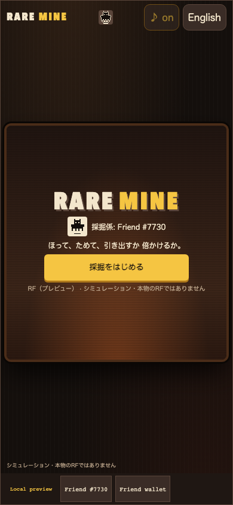

# Rare Mine / レアマイン

**Mine coins you can hear. Then withdraw them, or bet the pot: 45 % to double it, or it all burns.**

An original idle-and-tap mining game. Your verified Rare Friends NFT swings a pickaxe in a lantern-lit mine shaft. Every strike throws sparks and pops coins that arc into a cart with layered, pitch-varied clinks that get richer as the pile grows. When the pot looks good, choose **Withdraw** (safe forever) or **Bet** the whole pot on a 45 % chance to double it. Lose, and the stake is **burned**.

- **Builder/contact:** [@horusuzu](https://github.com/horusuzu), Genesis #597 holder. Contact through this PR or [source issues](https://github.com/horusuzu/rare-friends-lost-and-found/issues).
- **Category:** Token Activity.
- **Play:** [Rare Mine](https://horusuzu.github.io/rare-friends-lost-and-found/mine/)
- **Source:** [Game and run instructions](https://github.com/horusuzu/rare-friends-lost-and-found/tree/c8585fa98f386a1a0bae313fdfe3ef5d12e2e9bf/games/rare-mine). The repository also contains the holder's other entries; this one is a separate game and URL.
- **Stack:** FriendSDK v0.1.2 (host, eligibility, canonical sprite reader, `saveLocal`, trusted score-share bridge), React, TypeScript, a deterministic engine and a pixel canvas. Built with Claude Code.


## Mining

| Rule | Value |
| --- | --- |
| Automatic strike | every 1.0 s |
| Tap / Space / Enter | an extra strike; combo +1 per tap (max 12) speeds auto-mining up to 0.4 s |
| Coins per strike | 1–3 |
| Gold vein | 3 % of strikes, +12–30 |
| Gem | 0.8 % of strikes, +60–120, with a flash |
| Rock face | breaks every 8 strikes for +5 |

Expected yield is 3.975 coins per strike. Coins per minute:

| Play style | Coins per minute |
| --- | --- |
| Idle | about 240 |
| Tapping 3 times a second | about 1 300 |
| Tapping 6 times a second | about 2 000 |

The first choice arrives after about 40 s.

## Withdraw or bet

Both buttons are the same size and always on screen; Withdraw is never hidden.

- **Withdraw (引き出す):** the pot moves to the safe balance with a coin rain and a cash-register "cha-ching".
- **Bet (倍かけ):**
  - **Before anything is staked**, the screen shows 「勝率45%・勝てば2倍・負ければ全額バーン」 with the exact stake, win and burn amounts.
  - **Win:** the pot doubles and stays at risk. Bet again for a streak (×2, ×4, ×8 …, capped at 20 wins) or withdraw.
  - **Lose:** the whole stake burns ("🔥 N burned") and the burned total grows.
  - **When the result is fixed:** it is drawn when you confirm and saved already settled. The 1.6 s drum-roll only delays the reveal, so reloading cannot undo a burn.


### Odds and burn

- P(win) = 0.45 and the payout is ×2, so **EV = 0.9 × stake**: on average **10 % of every bet burns**.
- Measured over 100 000 bets: 44.9 % wins.
- A ×16 streak (4 wins in a row) happens 4.1 % of the time.
- The stats panel shows the safe balance, total mined, withdrawn, **burned**, best streak and bets won/lost. Two ledger identities are checked on every save load:
  - `mined + winnings = withdrawn + burned + pot`
  - `staked = winnings + burned`

**Share on X** posts the burned total and best streak (e.g. 「🔥1200 RF（プレビュー）をバーン！ 最高×16（4連勝）」) through the SDK host's trusted share bridge. The host fixes the title and URL.


## Economy: simulated, and what live play needs

**No real RF moves in this preview.** Mined coins are "RF (preview)", a simulated currency with no value that cannot be redeemed. It is labelled 「シミュレーション・本物のRFではありません」 on the title, the mine, the stats and the footer. The bet is resolved by a seeded local RNG; the game never calls the SDK's buy, play, settle or redeem, and the `game.json` chance-game block is an unused placeholder.

The SDK v0.1.2 chance-game API cannot express this bet. A live version needs a Rare Friends contract with:
- a **variable stake** (the whole pot) paid in RF from the canonical NFT wallet with an exact approval;
- a verifiable 45 % oracle roll, settled on-chain before any reveal;
- a **2× payout from a reserved bankroll**, so every open bet's maximum prize is backed;
- a **burn of lost stakes**;
- mining that either stays off-chain and unbacked, or is replaced by an RF deposit, since free mined coins cannot become real RF.

With those, each bet burns 10 % of the stake on average, and every lost streak burns the whole pot.

## Sound

- **Synthesised:** WebAudio only, no audio files.
- **Coin clinks:** inharmonic metal partials with a soft attack and random pitch and pan, richer as the pile grows.
- **Other cues:** a pick "tock", rock crumble, vein sparkle, gem chime, the withdraw "cha-ching", a drum roll for a bet, a win fanfare, and a burn whoosh and crackle.
- **Comfort:** cues are rate-limited, capped and compressed so long sessions stay pleasant.
- **♪ on/off** (`aria-pressed`, or **M**) is saved.

## Controls

| Action | Touch | Keyboard |
| --- | --- | --- |
| Extra strike | tap the mine | Space, Enter |
| Withdraw / open the bet | 引き出す / 倍かけ | W / B |
| Confirm / cancel the bet | かける / やめる | Y / N, Esc |
| Sound on/off, pause | ♪, Ⅱ | M, P |

Japanese is the default, with an English toggle. Other support:
- reduced motion: fewer coins; no sparks, shake or flash; a 0.3 s reveal;
- controls of at least 44 px;
- results announced with `role="status"`.



## Try it

1. Open the preview on Robinhood mainnet, **chain 4663**, in a browser with an injected wallet or a mobile wallet's in-app browser.
2. Choose an owned hardwired **Generations NFT (generation 1+)** or the configured **Genesis #597**. The trusted host checks current ownership.
3. No RF, activation or signature is needed. If the public RPC stalls while Friends load, the host stops after 20 seconds and offers a retry.

## Run locally

```sh
git clone --branch feat/rare-mine https://github.com/horusuzu/rare-friends-lost-and-found.git
cd rare-friends-lost-and-found
npm ci
npm run build
node scripts/dev-game.mjs dev games/rare-mine
```

## Checks and limitations

Validated source revision: [`c8585fa`](https://github.com/horusuzu/rare-friends-lost-and-found/tree/c8585fa98f386a1a0bae313fdfe3ef5d12e2e9bf); the repository's GitHub Actions checks pass on it.

- **Engine tests:** 31 pass. They cover:
  - the win rate converging to 45 % across seeds, EV 0.9×, the ×2 payout and burn, streak doubling and the cap;
  - withdraw, the ledger identities and mining events;
  - save round-trip, tamper rejection and the saved sound setting.
- **Browser checks** pass at 320×568, 390×844, 844×390, 960×640 and 1100×900:
  - the flow: mining, tap combo, withdraw, odds dialog, bets until both a win and a loss happen (each result predicted from the seed with the engine and matched against the UI), streak, burn stats;
  - the ♪ toggle, pause, language, reload persistence and overflow.
- **Genesis #597:** selection and play pass at 390 and 1100 px.
- **Repository:** tests (148 pass, 0 fail, 2 skipped), typecheck and SDK game validation pass. The new share row has its own test.

Known limits:
- The preview's bet stream is seeded, so someone reading the page with developer tools can foresee the next bet. That only matters in a simulation; live randomness must come from the on-chain oracle.
- Saves are local to the browser and NFT session.
- The synthesised sound has not been checked by ear on physical devices.
- Real-wallet play is not claimed.

The Genesis preview is a fork addition for review, not an upstream SDK capability or Rare Friends production approval. This entry is separate from Our Little Island (#20), Rare Invaders (#40), Rare Drop (#48), Rare Rush (#52), Rare Cards (#55), Rare Quest (#56) and Rare Delve (#60).

## Originality and credits

All art (mine shaft, rock faces, coins, gem, pickaxe, cart, jar, lantern), all sound and all text are original and drawn or synthesised in code. The Friend sprite comes from the canonical on-chain artwork through the SDK reader; SDK assets retain their [LICENSE](https://github.com/horusuzu/rare-friends-lost-and-found/blob/feat/rare-mine/LICENSE), [NOTICE](https://github.com/horusuzu/rare-friends-lost-and-found/blob/feat/rare-mine/NOTICE.md) and asset provenance.
