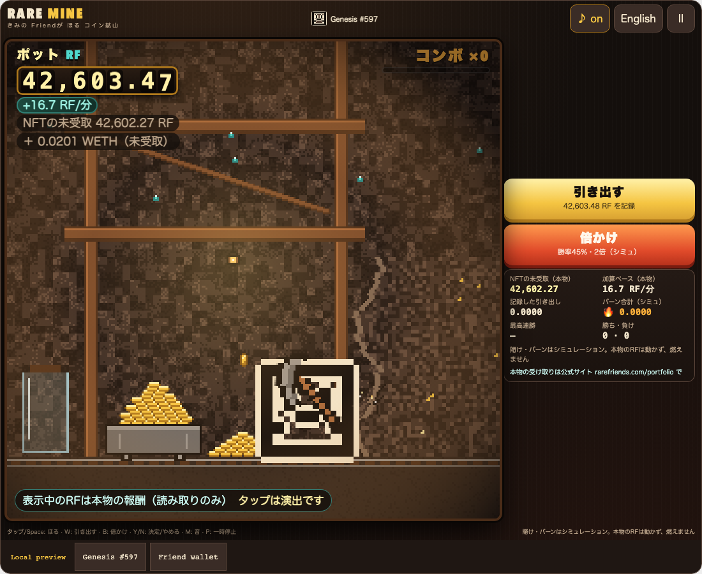
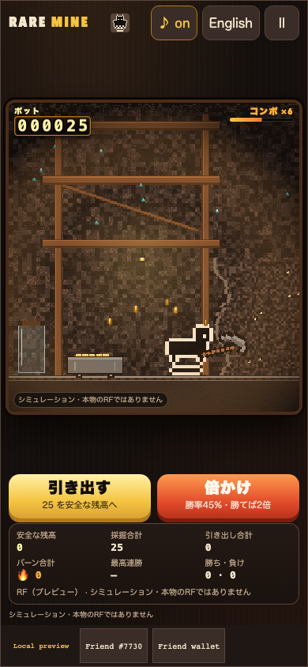
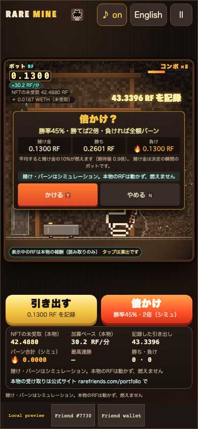
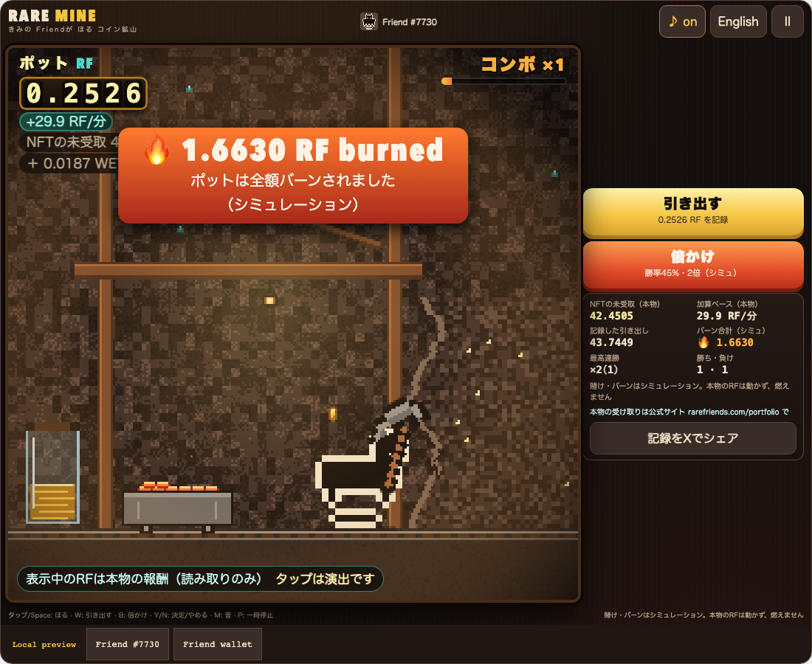
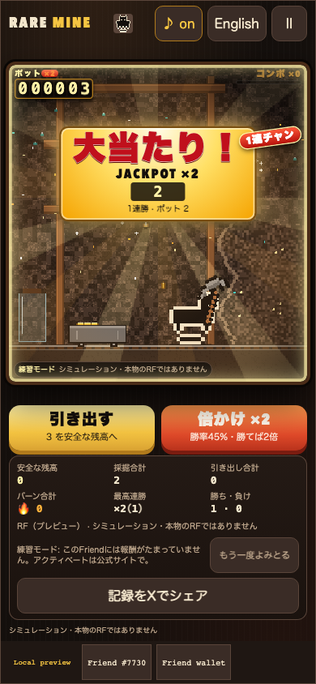
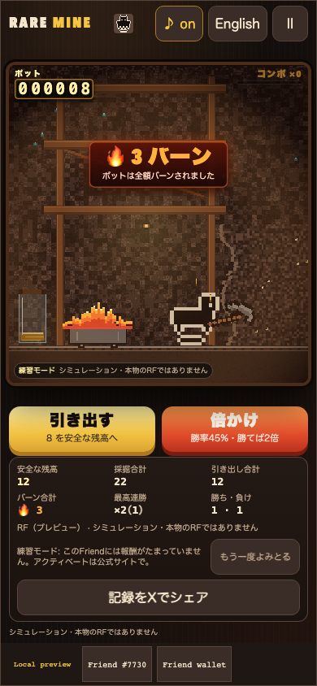
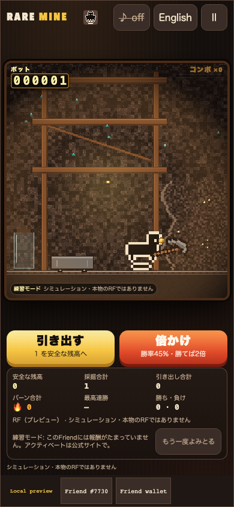

# Rare Mine / レアマイン

**Watch your NFT's real RF rewards pile up as mining, hear every coin, then withdraw or bet the pot: 45 % to double it, or it all burns.**

Rare Friends NFTs earn RF over time. Rare Mine turns that accrual into a mine you can watch and hear:
- **Your coins:** your verified Friend swings a pickaxe, and coins arc into a cart at the pace your NFT **actually** earns.
- **The counter:** the pot shows the real unclaimed RF, read live and read-only from the Rare Friends activation manager, and ticks up between reads.
- **The choice:** when the pot looks good, choose **Withdraw** or **Bet** the whole pot on a 45 % chance to double it. Lose, and the stake is **burned**.

- **Builder/contact:** [@horusuzu](https://github.com/horusuzu), Genesis #597 holder. Contact through this PR or [source issues](https://github.com/horusuzu/rare-friends-lost-and-found/issues).
- **Category:** Token Activity.
- **Play:** [Rare Mine](https://horusuzu.github.io/rare-friends-lost-and-found/mine/)
- **Source:** [Game and run instructions](https://github.com/horusuzu/rare-friends-lost-and-found/tree/57da00e304034e09105c43d8019e95a921b7bd8b/games/rare-mine). The repository also contains the holder's other entries; this one is a separate game and URL.
- **Stack:** FriendSDK v0.1.2, React, TypeScript, a deterministic engine and a pixel canvas. Built with Claude Code. SDK parts used:
  - the host and its eligibility check;
  - the canonical sprite reader;
  - the read-only `readRewards`;
  - `saveLocal`;
  - the trusted score-share bridge.



## Real rewards, visualised

- **Read:** the trusted host's read-only `client.readRewards()` returns the selected NFT's claimable RF and WETH (`earned()` on the activation manager, read at a fresh block after re-verifying ownership). The game polls it about every 20 s, never overlapping, pausing while hidden or paused, and backing off on errors.
- **Rate:** the accrual rate comes from successive reads. Between reads the odometer interpolates (`last + rate × elapsed`, never more than 30 s ahead) and eases to each new true value. A rate badge shows it, e.g. **+16.7 RF/分**.
- **Coins:** each coin is worth the smallest 1-2-5 step that keeps coins at 6 per second or fewer. That gives 2.4–6 coins a second at any real rate:

  | NFT | Accrual | Coin value | Coins per second |
  |---|---|---|---|
  | Genesis #597 | 16.4 RF/min | 0.05 RF | about 5.5 |
  | Friend #7730 | 0.2 RF/min | 0.001 RF | about 3.3 |

  The cart and jar fill with the pot.
- **Taps are cosmetic:** tapping the rock gives strikes, combos and clinks for fun but cannot create RF (「タップは演出です」).
- **Claims:** if the real amount drops because the holder claimed on the official site, the pot resets cleanly.
- **Practice mode:** used when the NFT is not activated or earns nothing, or when reads keep failing. The notice reads 「このFriendには報酬がたまっていません。アクティベートは公式サイトで。」. Simulated idle/tap mining is offered as 練習モード, with a button to re-read the real rewards.

Measured on mainnet today:

| NFT | Unclaimed RF | Accrual |
|---|---|---|
| Genesis #597 | ≈ 42 600 | ≈ 16.7 RF/min |
| Friend #7730 | ≈ 38 | ≈ 0.2 RF/min |



## Withdraw or bet the real accrual

- **Pot:** `pot = (real unclaimed RF − baseline) + streak bonus`. The first-ever baseline is 0, so the first pot is everything the NFT has accrued.
- **Withdraw (記録して引き出す):** records the pot and moves the baseline to the current real amount. Real claiming stays on the official site (rarefriends.com/portfolio, shown as text).
- **Bet (倍かけ):** the odds, stake, win and burn amounts are shown **before** staking: 「勝率45%・勝てば2倍・負ければ全額バーン」.
  - **Win:** the stake becomes a streak bonus, so the pot doubles and keeps growing with real accrual. Bet again (×2, ×4, ×8 …, capped at 20 wins) or withdraw.
  - **Lose:** the whole pot burns and the baseline moves to the current real amount.
  - The result is fixed at confirmation and saved settled, so reloading cannot undo it.
- **Odds:** P(win) = 0.45 with a ×2 payout, so **EV = 0.9 × stake**: on average **10 % of every bet burns**, and a lost streak burns the whole pot. Measured win rate: 44.9 % over 100 000 bets.
- **Stats:** unclaimed real RF, rate, withdrawn, **burned**, best streak and wins/losses.
- **Share on X:** posts the burned total and best streak through the host's trusted share bridge.





## Pachinko-style bet show

The bet's presentation is pure spectacle on top of an outcome the engine fixed at confirmation. The show receives the result as an input, so it cannot draw, change or delay it; the odds shown before staking never change.

- **Reach (リーチ).** The mine dims, spotlights sweep and three reels spin: coin, gem and your own Friend.
  - Two reels stop matching, then 「リーチ！」 is called with a rising siren, an accelerating heartbeat and a flashing border.
  - Some reaches escalate to 「激アツ！」 or 「超激アツ」 (rainbow), and some hang on a near miss.
  - Like a pachinko 信頼度, hotter tiers are more common before a win. The result is already fixed.
  - It lasts 2.6–3.95 s; tap to skip.
- **Win (大当たり).**
  - **On screen:** a single white flash, rotating gold light rays, confetti and a 「大当たり！ JACKPOT ×2」 banner.
  - **Coin torrent:** coins pour into the cart while the pot rolls up.
  - **Streaks:** ×4 「連チャン！」, ×8 「確変突入！」 with a rainbow wash, and ×16 and up **FEVER**.
  - **Sound:** a sub-bass hit, an original square/saw fanfare that climbs with each tier, a bell cascade, a 2–3 s 「ジャラジャラ」 coin pour, and a fever loop.
- **Lose (バーン).**
  - **On screen:** the last reel slides off with a clunk, a beat of silence, one dim orange flash and a short shake. Then the cart bursts into flame with embers, charred coins and smoke under 「🔥 N バーン」.
  - **Sound:** a boom and whoosh, a descending wah-wah brass, coin clatter and crackling embers.
- **Comfort.**
  - At most one full flash per celebration; no strobing and no red flashes.
  - Particles are capped.
  - Reduced motion gives a 0.3 s static reveal and still result cards.
  - ♪ / M mute everything.
  - Pause, page hide and a new bet stop the show at once.





## What is real and what is simulated

- **Real:** the unclaimed RF/WETH amounts and their accrual rate. Read-only; no transaction or signature.
- **Simulated:** the bet, the win and the burn. Every screen says 「賭け・バーンはシミュレーション。本物のRFは動かず、燃えません」. Real rewards are never moved or burned.
- **Not used:** the game never calls the SDK's buy, play, settle or redeem, and opens no links or popups. The `game.json` chance-game block is an unused placeholder.

To bet the real accrual live, Rare Friends would need:
- the rewards claimed to the canonical NFT wallet;
- a bet contract with a **variable stake** in RF from that wallet (exact approval);
- a verifiable **45 % oracle roll** settled before any reveal;
- a **2× payout from a reserved bankroll**;
- a **burn of lost stakes**.

With that, each bet burns 10 % of the stake on average and every lost streak burns the whole pot. That is the RF sink this entry proposes for Token Activity.



## Sound and controls

- **Sound:** WebAudio synthesis only.
  - Layered, pitch-varied coin clinks that get richer as the pile grows.
  - A pick "tock", a withdraw "cha-ching", a drum roll for the bet, a win fanfare, and a burn whoosh and crackle.
  - **♪ on/off** (or M) is saved.
- **Controls:**
  - tap or Space for strikes;
  - W withdraws, B opens the bet;
  - Y/N confirm or cancel;
  - P pauses.
- **Language and access:** Japanese by default with an English toggle. Reduced motion, controls of at least 44 px, and results announced with `role="status"`.

## Try it

1. Open the preview on Robinhood mainnet, **chain 4663**, in a browser with an injected wallet or a mobile wallet's in-app browser.
2. Choose an owned hardwired **Generations NFT (generation 1+)** or the configured **Genesis #597**. The trusted host checks current ownership.
3. An activated NFT shows its real unclaimed RF; one that is not activated opens practice mode. No RF, activation or signature is needed to play.

## Run locally

```sh
git clone --branch feat/rare-mine https://github.com/horusuzu/rare-friends-lost-and-found.git
cd rare-friends-lost-and-found
npm ci
npm run build
node scripts/dev-game.mjs dev games/rare-mine
```

## Checks and limitations

Validated source revision: [`57da00e`](https://github.com/horusuzu/rare-friends-lost-and-found/tree/57da00e304034e09105c43d8019e95a921b7bd8b); the repository's GitHub Actions checks pass on it.

- **Engine and show tests:** 74 pass (56 engine tests plus the reach plan, cue timelines and sound routing). They cover:
  - rate estimation, interpolation clamp and easing, claim/reset;
  - the baseline/pot/streak math and the ledger identities;
  - the mode decision, 45 % convergence, EV and burn;
  - saves (v1 → v2 migration, tamper rejection, the sound setting).
- **Browser checks** pass at 320×568, 390×844, 844×390, 960×640 and 1100×900 for both real mode and practice mode, over a growing `readRewards` fixture. Real mode checks:
  - the rate badge and the odometer rising between reads;
  - withdraw and a lost bet moving the baseline, and the pot identity;
  - the labels, and no links;
  - ♪ and M;
  - reload persistence;
  - practice mode for a Friend that is not activated, and switching back to real after re-reading.
- **Genesis #597:** passes at 390 and 1100 px.
- **Repository:** tests (148 pass, 0 fail, 2 skipped), typecheck and SDK game validation pass.
- **Live check:** the public page, driven headlessly with the holder's own address (read-only; no signature), showed Genesis #597's real unclaimed RF rising from 42 596 to 42 603 RF over 26 s at +16.7 RF/min.

Known limits:
- Any drop in the real amount is treated as a claim on the official site.
- An NFT whose reads do not grow is treated as not accruing.
- The preview's bet stream is seeded, so it can be foreseen with developer tools. Live randomness must be on-chain.
- Saves are local to the browser.
- The sound has not been checked by ear on physical devices.

The Genesis preview is a fork addition for review, not an upstream SDK capability or Rare Friends production approval. This entry is separate from Our Little Island (#20), Rare Invaders (#40), Rare Drop (#48), Rare Rush (#52), Rare Cards (#55), Rare Quest (#56) and Rare Delve (#60).

## Originality and credits

All art (mine shaft, rock faces, coins, gem, pickaxe, cart, jar, lantern), all sound and all text are original and drawn or synthesised in code. The Friend sprite comes from the canonical on-chain artwork through the SDK reader; SDK assets retain their [LICENSE](https://github.com/horusuzu/rare-friends-lost-and-found/blob/feat/rare-mine/LICENSE), [NOTICE](https://github.com/horusuzu/rare-friends-lost-and-found/blob/feat/rare-mine/NOTICE.md) and asset provenance.
