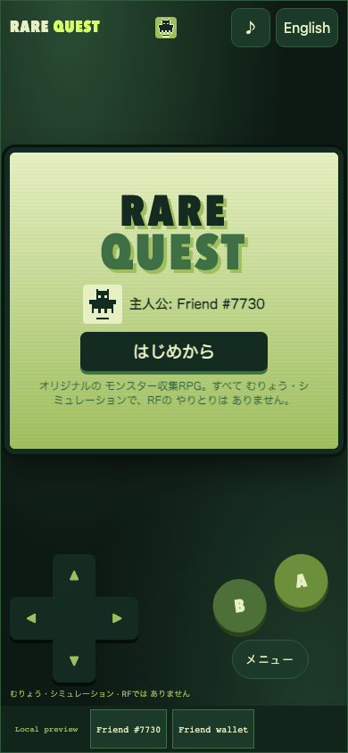
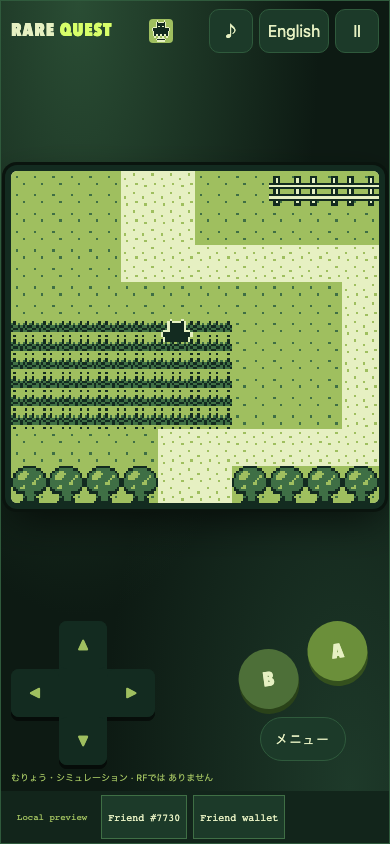
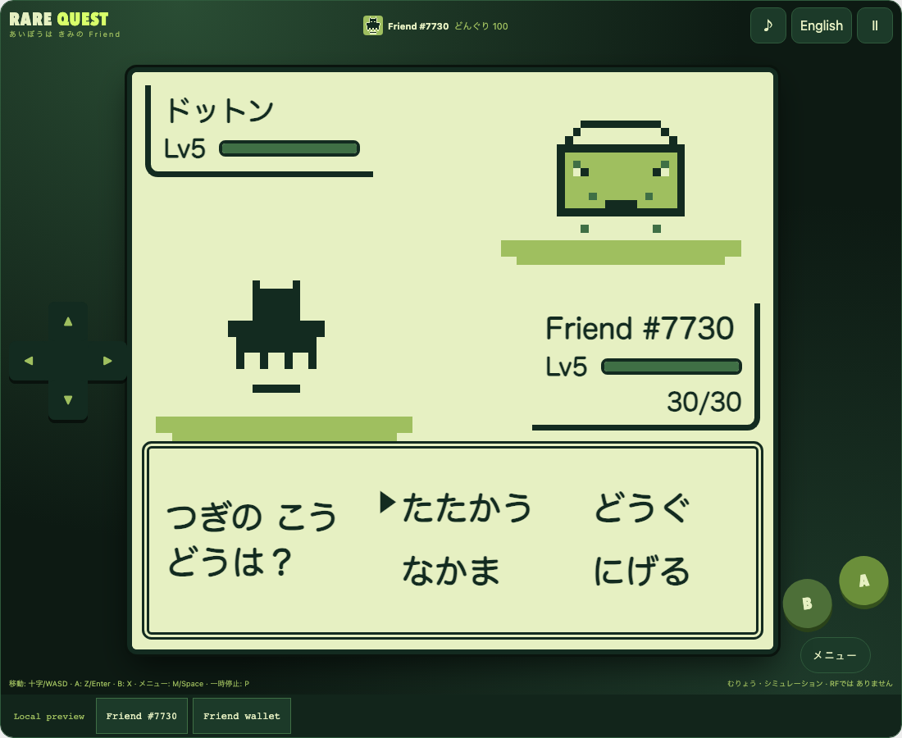
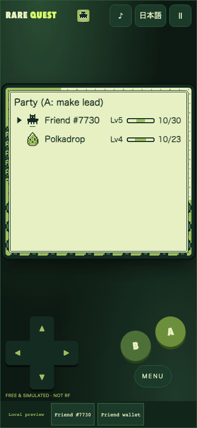

# Rare Quest / レアクエスト

**A handheld-era monster RPG where your partner is your own Friend.**

An original monster-collecting RPG in a four-shade green, 160 × 144 pixel style. Walk a small grid world, meet wild monsters in the tall grass, battle them turn by turn, befriend them with ribbons, and win the Jade Badge from the dojo master. No professor hands you a starter: **your partner is the verified Rare Friends NFT you chose**, drawn from its canonical on-chain sprite, with a type and stats derived from its token.

- **Builder/contact:** [@horusuzu](https://github.com/horusuzu), Genesis #597 holder. Contact through this PR or [source issues](https://github.com/horusuzu/rare-friends-lost-and-found/issues).
- **Category:** Character Spotlight.
- **Play:** [Rare Quest](https://horusuzu.github.io/rare-friends-lost-and-found/quest/)
- **Source:** [Game and run instructions](https://github.com/horusuzu/rare-friends-lost-and-found/tree/0009766b71cd45f05d3848f90ea4fb2798ee66a8/games/rare-quest). The repository also contains the holder's other entries; this one is a separate game and URL.
- **Stack:** FriendSDK v0.1.2 (host, eligibility, canonical sprite reader, `saveLocal`), React, TypeScript and a deterministic engine rendered to a 160 × 144 canvas. Built with Claude Code.



## Your Friend is the hero

- The Friend's canonical 16 × 16 sprite is the player character on the map and the partner in battle.
- Its **type** (one of six) and base HP/ATK/DEF/SPD come deterministically from its collection and token id, so every Friend plays a little differently and always the same way.
- It starts at level 5 with Dot Tackle and a type move, and learns stronger moves at levels 8, 13 and 20.
- Generations NFTs and Genesis #597 have separate saves.

## World

- **Moegi Village**: home (Grandma heals the team), the Nemunoki Lab (Dr. Yuzu explains types and gives five Friend Ribbons), signs and villagers.
- **Sprout Trail**: tall grass with a 12 % chance per step of a wild monster (levels 2–6).
- **Jade Town**: the Rest House (heals, sets your return point, sells items) and the **Jade Dojo**, where Master Kohaku fights with three monsters (Lv 7, 8, 10).



## Battles and befriending

- Commands **FIGHT / ITEM / PARTY / RUN**; the faster monster acts first.
- Six original types (SPROUT, EMBER, TIDE, GALE, STONE, PIXEL) with ×2 / ×0.5 matchups, 14 moves with power, accuracy and PP, same-type bonus, levelling and EXP, move learning, switching and fainting. Losing returns you to the last Rest House fully healed; nothing is lost.
- Ten wild species plus one dojo-only species, all original names, notes and pixel art.
- **Befriending:** throw a Friend Ribbon at a weakened wild monster. Chance = species rate × (3 × maxHP − 2 × HP) / (3 × maxHP); a befriended monster joins a party of up to six.





Full formulas (damage, stats, EXP, escape odds, type chart) are in the [game README](https://github.com/horusuzu/rare-friends-lost-and-found/blob/0009766b71cd45f05d3848f90ea4fb2798ee66a8/games/rare-quest/README.md).

## Controls

| Action | Touch | Keyboard |
| --- | --- | --- |
| Move / cursor | D-pad | Arrow keys or WASD |
| A: talk, confirm | A | Z or Enter |
| B: back, cancel | B | X or Backspace |
| Menu (party, items, notes, save) | MENU | M or Space |
| Pause | Ⅱ | P or Escape |

Menus and battle commands can also be tapped. Japanese and English switch at any time; sound cues are synthesised with a mute button; reduced-motion removes the battle wipe, blinking and banners.

## Economy

**No RF is used.** Ribbons and herbs cost **acorns**, an in-game, free, simulated currency earned by winning battles. Acorns are not RF, have no value and cannot be redeemed. The game calls no buy, play, settle or redeem action; the chance-game block in `game.json` is an unused schema placeholder required by the CLI. An RF-backed item shop could be added in a later phase with the Rare Friends team.

## Try it

Open the preview in a browser with an injected wallet (or a mobile wallet's in-app browser) on Robinhood mainnet, **chain 4663**. Choose an owned hardwired **Generations NFT (generation 1+)** or the configured **Genesis #597**; the trusted host checks current ownership. No RF, activation or signature is needed.

## Run locally

```sh
git clone --branch feat/rare-quest https://github.com/horusuzu/rare-friends-lost-and-found.git
cd rare-friends-lost-and-found
npm ci
npm run build
node scripts/dev-game.mjs dev games/rare-quest
```

## Checks and limitations

Validated source revision: [`0009766`](https://github.com/horusuzu/rare-friends-lost-and-found/tree/0009766b71cd45f05d3848f90ea4fb2798ee66a8); the repository's GitHub Actions checks pass on it.

- 48 engine tests, all passing (maps and collisions, encounters, damage/type/STAB, levelling and move learning, capture, fainting and whiteout, the dojo master's three-monster fight and badge, shop, save validation and round-trips).
- Browser checks at 320×568, 390×844, 844×390, 960×640 and 1100×900: title and intro, walking into the Sprout Trail, a wild battle won or ended by a Friend Ribbon (a befriended monster must join the party), keyboard menu save, pause, language switch, continuing after reload, touch-target size and overflow.
- Genesis #597 selection and launch at 390 and 1100 px.
- Repository typecheck, tests and SDK game validation.

Known limits: the party holds six and there is no storage box, so ribbons are not used with a full party. The world is one route and one town; the dojo master fight is covered by engine tests but was not fully played through in the browser. Saves are local to the browser and NFT session. Real-wallet play on the public URL and physical-device testing are not claimed.

The Genesis preview is a fork addition for review, not an upstream SDK capability or Rare Friends production approval. This entry is separate from Our Little Island (#20), Rare Invaders (#40), Rare Drop (#48), Rare Rush (#52) and Rare Cards (#55).

## Originality and credits

Rare Quest is inspired by the handheld monster-collecting RPG genre in general (grid overworld, tall grass, turn-based battles, befriending, a badge). All names, monsters, moves, items, maps, dialogue, pixel art, sound cues and interface are original; no third-party game, company or character names and no extracted, traced or copied assets, music or text are used. Canonical Friend artwork and runtime: Rare Friends / FriendSDK, retaining [LICENSE](https://github.com/horusuzu/rare-friends-lost-and-found/blob/feat/rare-quest/LICENSE), [NOTICE](https://github.com/horusuzu/rare-friends-lost-and-found/blob/feat/rare-quest/NOTICE.md) and SDK asset provenance.
