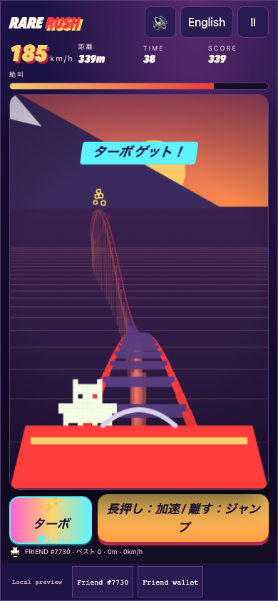
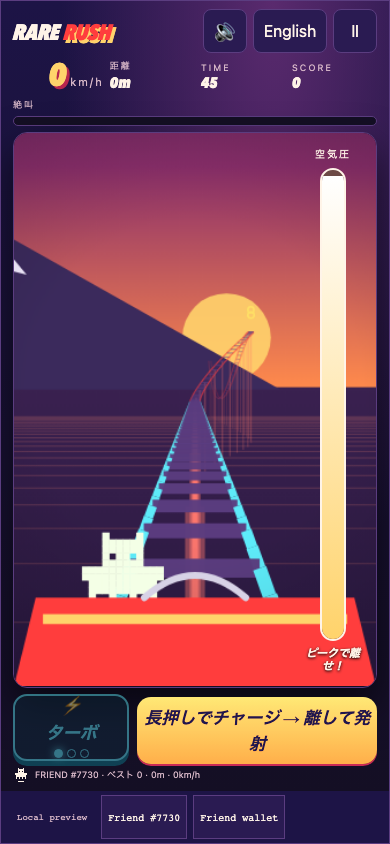
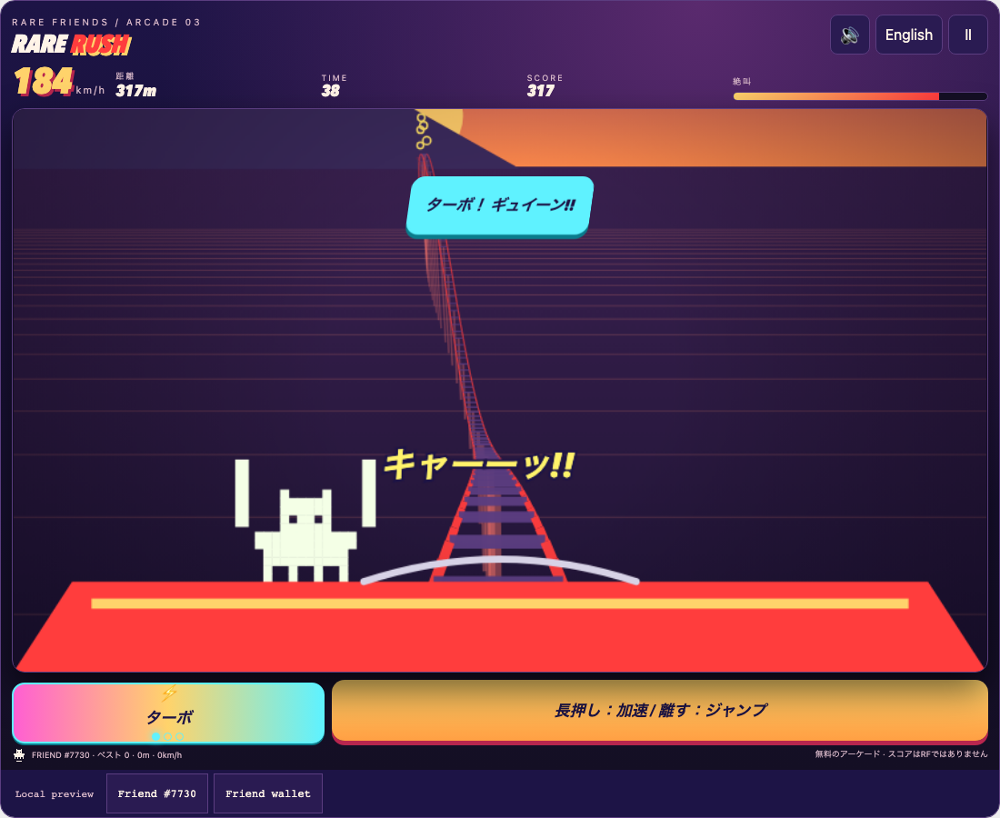
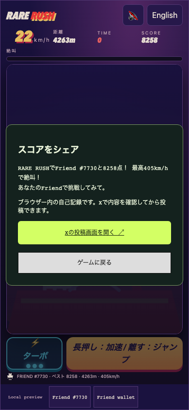

# Rare Rush

**0 → 200 km/h. Scream.**

A one-button, first-person thrill-coaster run. Your Rare Friend rides the front seat, arms up, while you launch from a standstill, tip over crest after crest under Mt. Fuji, fly off the hills and fire turbo boosts to 432 km/h.

- **Builder/contact:** [@horusuzu](https://github.com/horusuzu), Genesis #597 holder. Contact through this PR or [source issues](https://github.com/horusuzu/rare-friends-lost-and-found/issues).
- **Category:** Character Spotlight.
- **Play:** [Rare Rush](https://horusuzu.github.io/rare-friends-lost-and-found/rush/)
- **Source:** [Game and run instructions](https://github.com/horusuzu/rare-friends-lost-and-found/tree/166555d01dcc05a6cb2b9443145e8808da3efd67/games/rare-rush). The source repository also contains Our Little Island, Rare Invaders and Rare Drop; Rare Rush is a separate entry and URL.
- **Stack:** FriendSDK v0.1.2 with documented preview extensions, React, TypeScript and Canvas, with a small deterministic coaster engine and a first-person projection renderer written for this game. Built with Claude Code.



## Why Rare Friends

The selected NFT is the rider. The camera sits in the second row, so the player's own Friend, drawn from its canonical on-chain pixels, is in the front seat for the whole ride and throws its arms up on every big drop and in Scream Mode. The start screen introduces it as "Today's rider", and the score challenge names it. Generations NFTs remain the main entry path; at the holder's request, their Genesis #597 is also playable using the collection-specific ownership gate and artwork reader already used by the holder's other entries.

## Try one complete run

1. Open the preview in a browser with a compatible injected wallet, including a mobile wallet's in-app browser. Use Robinhood mainnet, **chain 4663**.
2. Select an owned, hardwired **Generations NFT (generation 1+)**, or the configured **Genesis #597**. The trusted host checks current ownership before starting. No activation, RF funding or transaction signature is required.
3. **Launch:** hold to build air pressure. It peaks after 1.2 s and then falls; release at the peak for a perfect launch (about 216 km/h).
4. **Ride:** holding makes the car heavier. Hold on downhills to gain speed; let go on the way up to keep it, and release over a crest to fly. Land along the slope for +12 % speed.
5. **Turbo:** collect glowing turbo capsules (stock up to three; you start with one) and fire one for +72 km/h and a 1.6 s push, with the top speed raised from 360 to 432 km/h.
6. **Time:** 45 seconds, +15 seconds at every 1,000 m checkpoint. Boost gates, sparks and the Scream meter (full = 6 s of double points) add to the score. The ride ends at zero.
7. On the result screen choose **Share score on X**. A trusted host dialog previews the score, top speed and NFT. Open X's composer, review the draft and post yourself. The game never posts automatically.



### Controls

- **Phone:** hold the big HOLD button (or anywhere on the ride); tap TURBO. Buttons are at least 44 px tall and sit above the wallet toolbar.
- **Computer:** Space / ↓ / Enter to hold; Shift / ↑ / T for turbo; P or Escape to pause.
- **Landscape:** a side column holds speed, score and both buttons; portrait and the 960 × 640 reference size are also supported.
- Switching away pauses play. Sound is a synthesised wind rush that follows your speed, with a mute button. Reduced-motion preference removes screen shake, banking, rumble, speed streaks, the turbo flash and spinning sparks.



## Scoring, costs and rewards

One point per metre, sparks 10, boost gates 50, perfect landings 100; Scream Mode doubles all of it for six seconds. Turbo capsules sit past every fourth crest, boost gates in every sixth valley, and every fourteenth crest is the 79 m giant. The track is generated from a per-run seed.

Free play, no RF spending, burning, prizes, consumables or redemption. Turbos are in-run pickups with no value outside the ride. Scores have no monetary value and are self-reported browser-local results, not verified rankings. The required SDK chance-game schema is unused: no buy/play/settle/redeem call is made. The host's preview balance is simulated.

The X draft contains the score, top speed in km/h (bounded to 1–450), the selected NFT label, the game URL and hashtags, and no wallet address. The game iframe keeps `sandbox="allow-scripts"`; the bounded bridge request carries only score, speed and language, and the host's fixed per-game table supplies the title and URL.



## Run locally

Node.js 22+:

```sh
git clone --branch feat/rare-rush https://github.com/horusuzu/rare-friends-lost-and-found.git
cd rare-friends-lost-and-found
npm ci
npm run build
node scripts/dev-game.mjs dev games/rare-rush
```

For static hosting, run `node scripts/dev-game.mjs build games/rare-rush --outdir release-rush` and keep LICENSE, NOTICE.md and asset provenance with the build. No private key is needed.

## Checks and limitations

**Updated 2026-09-26.** The linked revision (`166555d`) adds synthesised sound effects with a saved ♪ on/off toggle (M key), a 20-second limit with a Retry button when Friend loading stalls on a slow public RPC and phone layouts (a larger play area, thumb-reach controls, no double-tap zoom, pull-to-refresh or long-press menus during play) to the originally submitted code. The repository's GitHub Actions checks pass on it, and the game's new phone test passes at 360×640, 375×667, 390×664, 430×740 and 664×390 (Chromium phone emulation; not yet on physical devices).

Validated source revision: [`166555d`](https://github.com/horusuzu/rare-friends-lost-and-found/tree/166555d01dcc05a6cb2b9443145e8808da3efd67); the repository's GitHub Actions checks pass on it. Engine coverage: 100% lines/functions, 98.5% branches. Automated browser checks use SDK wallet/RPC fixtures; screenshots show fixture Friend #7730, not a claim of ownership.

- Engine tests (13) cover the deterministic smooth track and the 79 m crest, launch pressure and perfect launch, gravity with dive, the chain lift, take-off and landing grades (including that brief crest skims are not graded), sparks, boost gates, turbo capsules and firing, the speed caps, checkpoints, time-out and Scream Mode.
- Browser checks at 320×568, 390×844, 844×390, 960×640 and 1100×900 cover boarding, charging and releasing the launch, riding with holds, firing turbo, pausing (the ride freezes), mute, a full run to the result screen, the X draft and fixed URL, an intercepted composer, riding again in English, control placement above the host toolbar and overflow.
- Genesis #597 selection, launch and rejection after an ownership transfer pass at 390 and 1100 px.
- Repository tests (146 pass, 0 fail, 2 skipped), typecheck, SDK game validation for every game, and the existing Rare Drop and Rare Invaders browser checks pass with the shared score-share change.

Best scores are local to the browser and NFT session. No online leaderboard or anti-cheat. X login and final posting are handled by X; automated tests never publish a post. Mobile wallet availability depends on the browser; standalone Safari/Chrome without an injected wallet cannot connect. Browser tests emulate device sizes; they are not physical iOS/Android certification. The holder reviewed the ride and approved this submission; real-wallet play on the public URL is not separately recorded here.

The Genesis preview and trusted score-sharing extensions are fork additions for review, not upstream SDK capabilities or Rare Friends production approval. This entry does not replace Our Little Island (#20), Rare Invaders (#40) or Rare Drop (#48).

## Credits

Canonical Friend artwork and runtime: Rare Friends / FriendSDK, retaining [LICENSE](https://github.com/horusuzu/rare-friends-lost-and-found/blob/feat/rare-rush/LICENSE), [NOTICE](https://github.com/horusuzu/rare-friends-lost-and-found/blob/feat/rare-rush/NOTICE.md) and SDK asset provenance. Sky, mountain, rail, car, capsules, sparks, sound and interface are drawn or synthesised by this game's code. The ride is inspired by launch coasters and big-drop coasters in general; it uses no park, ride or game names, logos, music or extracted assets.
